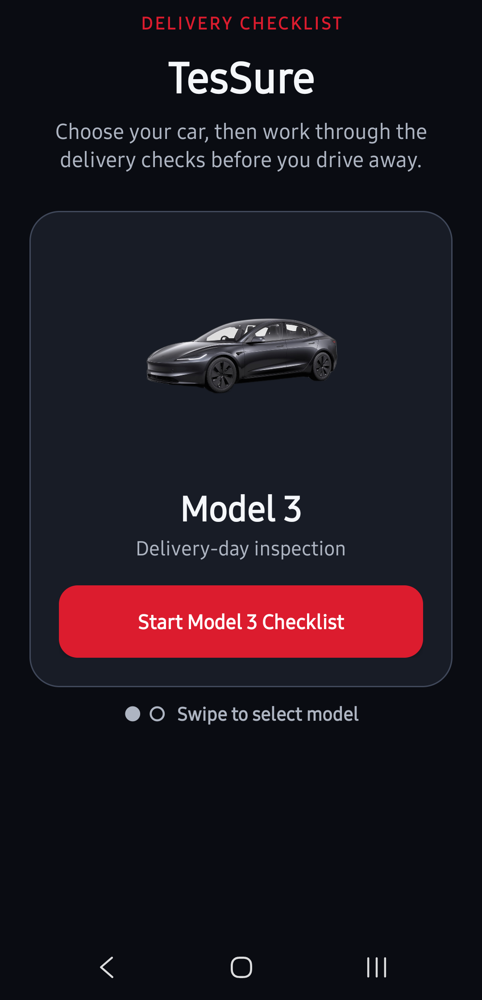
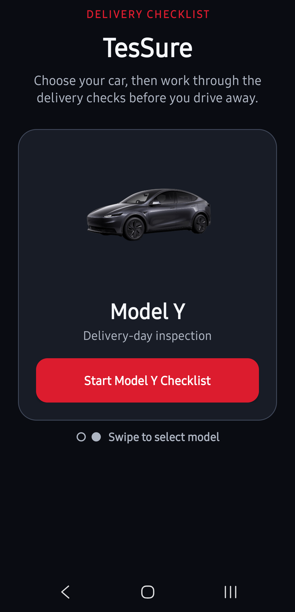
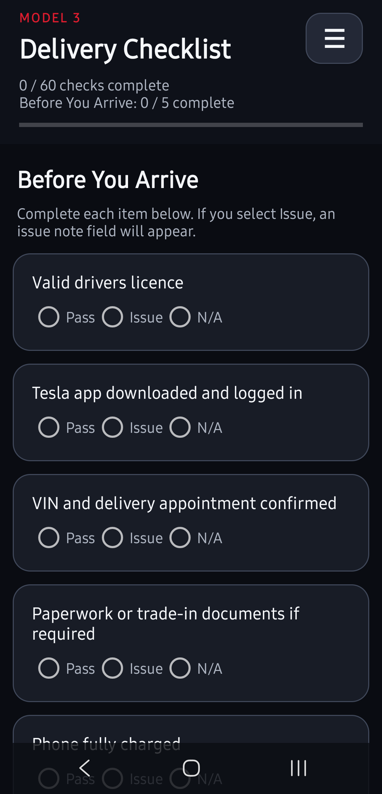
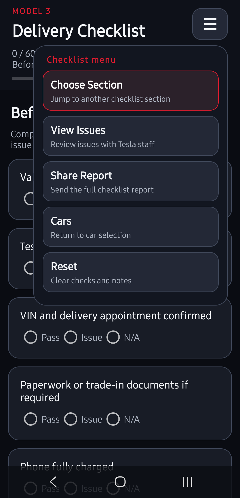
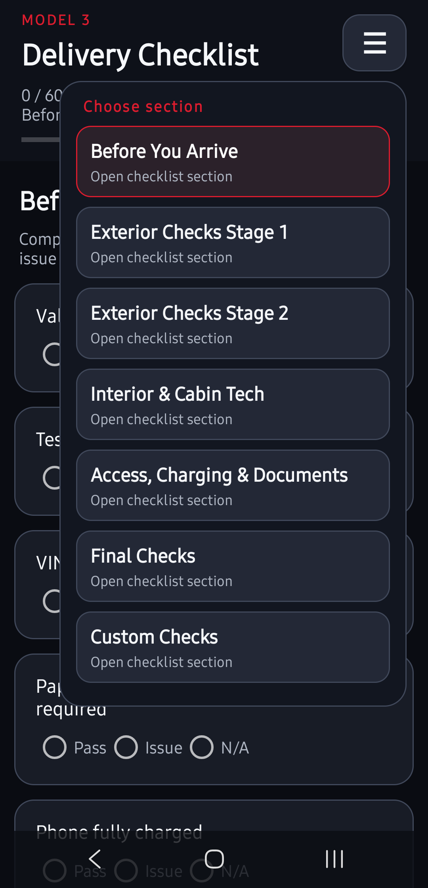
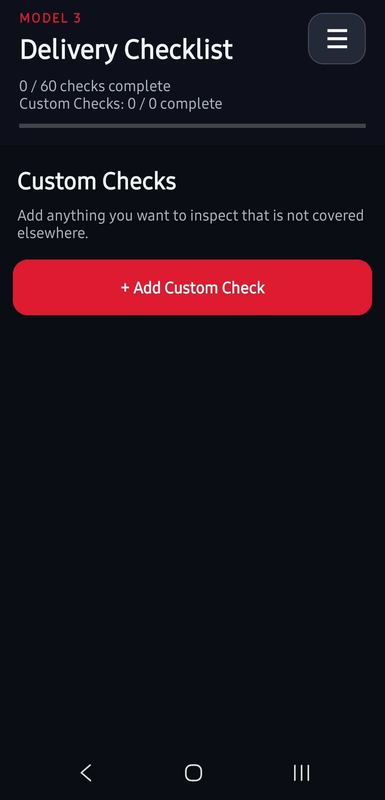
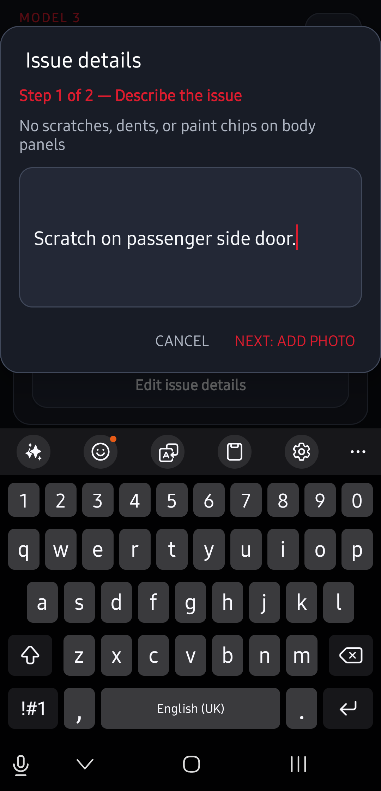
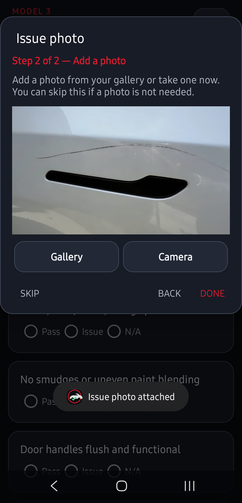
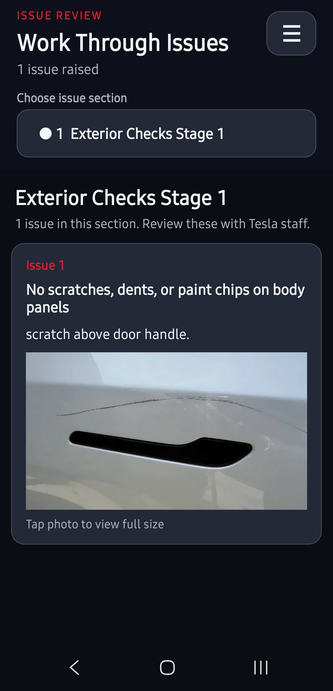

# TesSure

TesSure is a simple Android checklist for inspecting a Tesla on collection day.

## App preview

<table>
  <tr>
    <td align="center"> Choose Model 3</td>
    <td align="center"> Choose Model Y</td>
    <td align="center"> Work through the checklist</td>
  </tr>
  <tr>
    <td align="center"> Checklist actions</td>
    <td align="center"> Jump between sections</td>
    <td align="center"> Add custom checks</td>
  </tr>
  <tr>
    <td align="center"> Describe an issue</td>
    <td align="center"> Attach supporting photos</td>
    <td align="center"> Review issues with Tesla staff</td>
  </tr>
</table>

## Features

- Model 3 and Model Y support
- Separate saved progress for each model
- Pass, Issue, and N/A responses
- Notes and photos for reported issues
- User-created custom checks
- Issue review and report sharing
- Works offline with no account required
